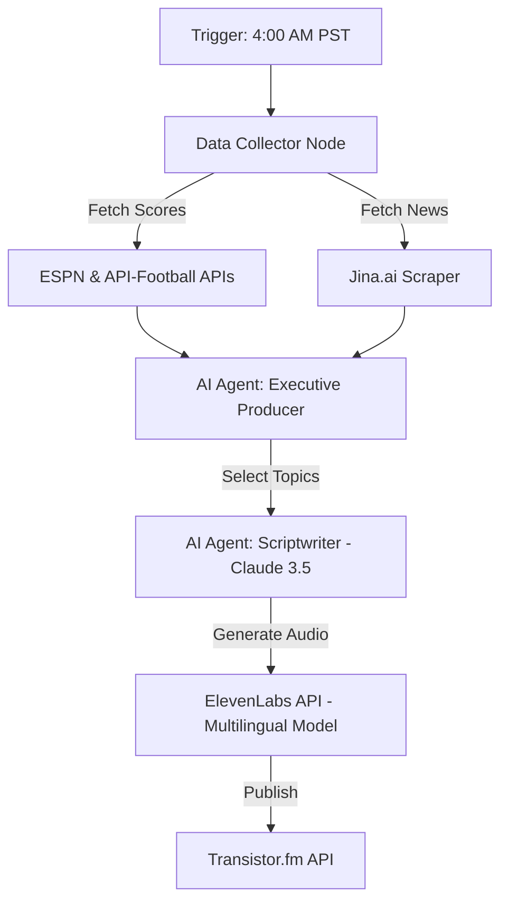

# 🎙️ Varsity FC: End-to-End Automated Sports Podcast Pipeline

### **Project Overview**
Varsity FC is a fully automated "Headless Media" pipeline that produces a daily sports podcast without human intervention. The system scrapes real-time data, uses multi-agent AI to write scripts, synthesizes broadcast-quality audio, and publishes episodes to RSS feeds.

**Live Demo:** https://varsityfcrundown.transistor.fm/  
**Video Walkthrough:**https://www.loom.com/share/d524694580894dd3a52312ea6e47d957

---

### 🏗️ Architecture
The pipeline is built on a **Low-Code/Serverless** architecture using **n8n** as the orchestrator.

